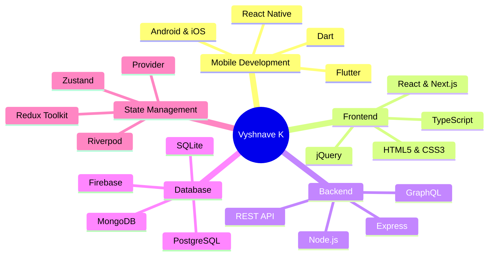

<div align="center">

# 👋 Hi, I'm Vyshnave K

### 🚀 Software Developer | Flutter & React Specialist | Open Source Enthusiast

[](https://vyshnave-portfolio.netlify.app/)
[](mailto:mail.vyshnave@gmail.com)
[](#)
[](https://github.com/vyshnave1997)


</div>

---

## 🌟 About Me

I am a versatile **Software Developer** with expertise in building modern, scalable applications across web and mobile platforms. Specializing in **React.js, Next.js, Flutter**, and **TypeScript**, I create seamless digital experiences with a strong focus on **performance optimization**, **clean architecture**, and **user-centric design**.

```typescript
const vyshnave = {
  role: "Software Developer",
  company: "Techfriar Pvt Ltd",
  specializations: ["Web Development", "Mobile Development", "UI/UX"],
  code: ["JavaScript", "TypeScript", "Dart", "HTML", "CSS", "SQL"],
  technologies: {
    frontend: {
      web: ["React", "Next.js", "Redux", "Three.js", "GSAP"],
      mobile: ["Flutter", "React Native"],
      styling: ["Tailwind CSS", "SCSS", "Material UI", "Styled Components"]
    },
    backend: ["Next.js API Routes", "Node.js", "Express"],
    databases: ["MongoDB", "PostgreSQL", "Firebase", "SQLite"],
    tools: ["Git", "Docker", "Webpack", "Vite", "Figma", "Postman"],
    stateManagement: ["Redux Toolkit", "Zustand", "Context API", "Provider", "Riverpod"]
  },
  currentFocus: "Cross-Platform Development & Performance Optimization",
  architecture: ["Clean Architecture", "MVC", "MVVM", "Component-Based Design"],
  openForCollaboration: true
};
```

- 🔭 **Currently Working:** Software Developer at **Techfriar Pvt Ltd**
- 📱 **Mobile Expertise:** Building cross-platform apps with **Flutter** and native performance
- 🌐 **Web Expertise:** Crafting responsive, high-performance web applications with **React** & **Next.js**
- 🌱 **Currently Learning:** Advanced Flutter Animations, WebGL, Microservices Architecture
- 💡 **Passionate About:** Software Development, Mobile Apps, UI/UX Design, Data Visualization
- 👯 **Open to:** Collaborating on Open Source Projects & Innovative Applications
- 💬 **Ask me about:** React.js, Next.js, Flutter, Redux, TypeScript, State Management, API Integration
- 📫 **Reach me:** [mail.vyshnave@gmail.com](mailto:mail.vyshnave@gmail.com)
- ⚡ **Fun fact:** I love turning complex problems into elegant, simple solutions across any platform

---

## 🛠️ Tech Stack & Expertise

<div align="center">



</div>

---

<div align="center">

### 💻 **Core Technologies**

</div>

<table align="center">
<tr>
<td valign="top" width="33%">

#### 📱 Mobile Development
```yaml
Primary:
  - Flutter & Dart
  - React Native
  
Platforms:
  - Android
  - iOS
  
Features:
  - Cross-platform apps
  - Native performance
  - Custom animations
  - State management
```

</td>
<td valign="top" width="33%">

#### 🌐 Frontend Development
```yaml
Core:
  - React.js
  - Next.js
  - TypeScript
  
Styling:
  - Tailwind CSS
  - SCSS/Sass
  - Material UI
  
Tools:
  - Webpack
  - Vite
  - Figma
```

</td>
<td valign="top" width="33%">

#### ⚙️ Backend & Database
```yaml
Backend:
  - Node.js
  - Express
  - Next.js API
  
Database:
  - MongoDB
  - PostgreSQL
  - Firebase
  - SQLite
  
API:
  - REST
  - GraphQL
```

</td>
</tr>
</table>

---

<div align="center">

### 🎯 **Specialized Skills**

<table>
<tr>
<td align="center" width="25%">
<br>

<br><br>
<b>State Management</b>
<br><br>
Redux • Zustand<br>
Provider • Riverpod<br>
Context API
<br><br>
</td>
<td align="center" width="25%">
<br>

<br><br>
<b>3D & Animation</b>
<br><br>
Three.js • GSAP<br>
D3.js • Chart.js<br>
Flutter Animations
<br><br>
</td>
<td align="center" width="25%">
<br>

<br><br>
<b>DevOps & Tools</b>
<br><br>
Git • GitHub<br>
Docker • Postman<br>
VS Code • Xcode
<br><br>
</td>
<td align="center" width="25%">
<br>

<br><br>
<b>UI/UX Design</b>
<br><br>
Figma • Material Design<br>
Responsive Design<br>
User Experience
<br><br>
</td>
</tr>
</table>

</div>

---

<div align="center">

### 🔥 **Technology Proficiency**


</div>

---

<div align="center">

### 🌟 **Complete Arsenal**

<details>
<summary><b>🚀 Click to expand full technology stack</b></summary>
<br>

| Category | Technologies |
|:---------|:-------------|
| **Languages** |       |
| **Frameworks** |      |
| **State Management** |      |
| **Styling** |     |
| **Databases** |     |
| **Visualization** |     |
| **Tools** |       |
| **IDEs** |    |

</details>

</div>

---

## 💼 Professional Experience

### 💻 Software Developer @ Techfriar Pvt Ltd

**Key Achievements:**
- Architected and developed cross-platform mobile applications using Flutter, serving 10,000+ users
- Built scalable web applications with React.js and Next.js, implementing server-side rendering for optimal performance
- Integrated RESTful APIs and real-time database solutions with Firebase and MongoDB
- Implemented state management solutions using Redux Toolkit, Riverpod, and Provider patterns
- Optimized application performance resulting in 40% faster load times and improved user engagement
- Collaborated with cross-functional teams following Agile methodologies to deliver high-quality products on schedule
- Designed and implemented responsive UI components with Material Design and custom animations
- Conducted code reviews and mentored junior developers on best practices

**Technical Contributions:**
- Full-stack development with Next.js API routes and database integration
- Complex state management implementation across web and mobile platforms
- Custom animation implementations using GSAP and Flutter's animation framework
- Data visualization solutions with D3.js and Chart.js
- CI/CD pipeline setup and optimization

---

## 📊 GitHub Statistics

<div align="center">
  
  
</div>

<div align="center">
  
</div>

<div align="center">
  
</div>

---

## 🎯 What I'm Currently Working On

- 🔨 Building innovative cross-platform applications with Flutter and React
- 📱 Developing production-ready mobile apps with advanced animations and smooth UX
- 🌐 Creating high-performance web applications with Next.js and TypeScript
- 📚 Exploring advanced Flutter patterns, WebGL, and microservices architecture
- 🌱 Contributing to open-source Flutter and React projects
- 💡 Writing technical articles and sharing development insights
- 🎨 Experimenting with 3D graphics using Three.js and Flutter's 3D capabilities

---

## 🚀 Featured Skills

<div align="center">

| Category | Skills |
|----------|--------|
| **Mobile** | Flutter • Dart • React Native • iOS • Android • Cross-Platform Development |
| **Frontend** | React • Next.js • TypeScript • Redux • Three.js • GSAP • jQuery |
| **Backend** | Node.js • Express • Next.js API • REST API • GraphQL |
| **State** | Redux Toolkit • Zustand • Provider • Riverpod • Context API |
| **Database** | MongoDB • PostgreSQL • Firebase • SQLite |
| **Styling** | Tailwind CSS • SCSS • Material UI • Styled Components |
| **Tools** | Git • Docker • VS Code • Android Studio • Xcode • Figma |
| **Other** | Data Visualization • Animations • Performance Optimization • Clean Architecture |

</div>

---

## 📈 Development Philosophy

- ✨ **Quality Over Quantity:** Writing clean, maintainable, and well-documented code
- 🎯 **User-Centric:** Prioritizing user experience and accessibility in every project
- 🚀 **Performance First:** Optimizing for speed and efficiency across all platforms
- 🧪 **Test-Driven:** Implementing comprehensive testing strategies for reliability
- 📚 **Continuous Learning:** Staying updated with latest technologies and best practices
- 🤝 **Collaboration:** Believing in the power of teamwork and knowledge sharing

---

## 📫 Let's Connect & Collaborate!

I'm always excited to discuss new projects, innovative ideas, and collaboration opportunities. Whether it's web development, mobile apps, or open-source contributions, let's build something amazing together!

<div align="center">

[](mailto:mail.vyshnave@gmail.com)
[](https://vyshnave-portfolio.netlify.app/)
[](#)
[](https://github.com/vyshnave1997)

</div>

---

<div align="center">

### 💡 *"First, solve the problem. Then, write the code."* – John Johnson

### ⭐ **If you find my work interesting, consider giving a star to my repositories!**

**Made with ❤️ by [Vyshnave K](https://github.com/vyshnave1997)**

</div>
